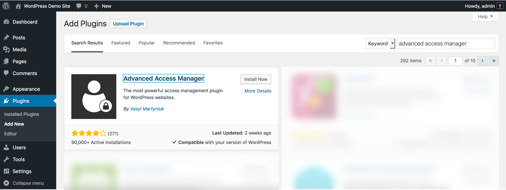

There are a few different ways to install the AAM plugin. However, it is just a regular WordPress plugin, so do not overthink.

## Install from the WP repository

AAM is a free WordPress plugin published on [the official WordPress plugin repository](https://wordpress.org/plugins/advanced-access-manager/). To install it, go to your WordPress website backend area and navigate to the `Plugins->Add New`. Search for the _Advanced Access Manager_ and install it on your website.

Upon AAM activation, no additional steps required. The new `AAM` menu item will appear in the admin menu.

## Install manually

To install the AAM plugin manually, download it from the official WP repository [here](https://wordpress.org/plugins/advanced-access-manager/) and connect via sFTP to your server.

Unpack the downloaded ZIP archive to the `/wp-content/plugins` folder. Then you can log in to your backend and on the _Plugins_ page activate the "Advanced Access Manager" plugin.

## Things to consider

By default, AAM is allowed for any user that belongs to the WordPress standard _Administrator_ role. If there is more than one administrator on a website, consider defining which administrator user(s) can manage access. For more detail, check the [How to manage access to AAM page for other users?](/question/aam/manage-access-to-aam-for-other-users) article.
