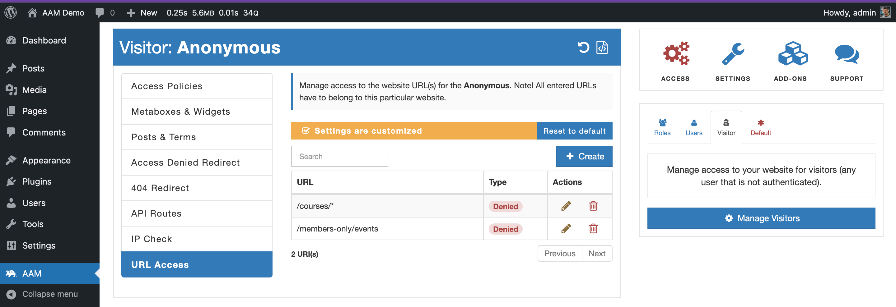
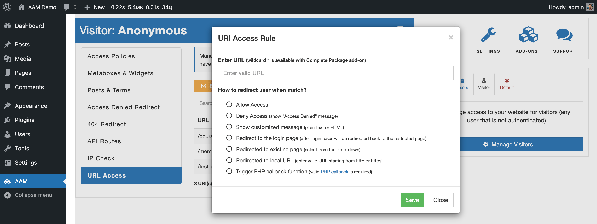

Another way to manage access to parts of the WordPress website is by URL. The "URL Access" service allows defining access controls to any individual URL that is within the site. It can be any _frontend_, _backend_ or RESTful API URL.

The service allows defining various ways to change the user's experience when they land on a restricted URL or redirect to a different location.

The URL Access service offers the following options:
- **Deny Access**. This option shows the "Access Denied" message.
- **Show Customized Message**. You can provide a simple text or a complex HTML markdown that a user sees instead of the restricted content.
- **Redirect to the Login Page**. An unauthenticated user redirects to the login page and, after successful authentication, redirects back to the original page.
- **Redirect to the Existing Page**. Select the page a user redirects and what HTTP redirect code to use during redirect (e.g. `307 Temporary Redirect`, `301 Moved Permanently`, etc.)
- **Redirect to Local URL**. For security reasons, a redirect is allowed to any URL for the list of allowed domains (typically only within the site).
- **Trigger PHP Callback Function**. A custom callback function can be triggered that redirects or changes user experience.

The protected URL also supports wildcard  `*` denotation with the premium [Complete Package](/premium). This way, you can secure a group of URLs. For example, the `/courses/*` rule protects URLs like `/courses/how-to-write-essay` or `/courses/introduction-to-aws`.