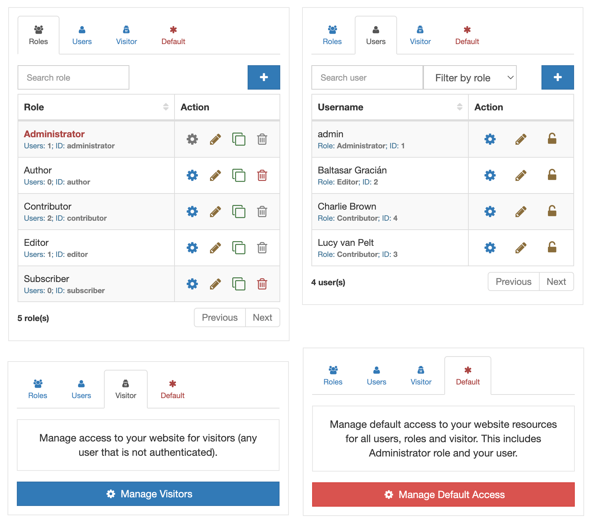
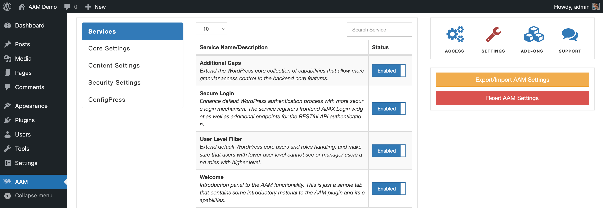

AAM is quite a complex plugin with a few hundred different features. We spent most of our dev work on an intuitive and easy-to-use UI to maximize the webmaster’s efficiency. Check this introductory video that walks you through AAM UI.

<YouTube id="mj5Xa_Wc16Y" />

## Why UI?

We built AAM UI to give you an easy way to manage the most common access controls to WordPress resources for any role, individual user, and visitors (anonymous users) or define default access settings altogether.

For an untrained user, the UI may appear overwhelming. However, with a bit of mental effort, you can grasp the main idea quickly. So, let us dive in.

## AAM Pages

The AAM UI contains three pages that have distinct purposes. You can switch between pages with the help of a widget on the _Sidebar_.

The _Access_ page allows you to manage access controls to your users, roles, visitors or define default access altogether. It is the page where you spend majority of your time.

The _Settings_ page contains various group of most common settings that change the way AAM behaviors. Additionally it has the ConfigPress tab for more advanced configurations.

On the _Add-Ons_ page you can manage your premium license key and download our premium and free add-ons.

Now, let us walk through each page one by one.

## Access Page

When you are on the _AAM_ page, you always manage access controls for somebody. It can be a role, user, or default access for everybody (including your user). Pay attention to the _Status Bar_ at the top of the page that tells you for what role or user you manage access.

::: danger Important!
AAM allows managing access for the high privilege roles and users like _Administrator_ or your user. Pay extra attention to the _Status Bar_ to avoid accidentally restricting access to critical pages or the entire website. If you made a mistake, do not panic, you can always [reset AAM settings](/question/aam/how-to-reset-aam-settings).
:::

The UI is divided into two areas.
- The _Main_ area includes the collection of various tabs like "Backend Menu", "Posts & Terms" or "404 Redirect". It is the place where you can configure your desired access controls and behavior.
- The _Sidebar_ area contains a couple of widgets that allow you to switch between different AAM pages like "Settings", and "Add-Ons" or select to which role or user you want to manage access controls.

You may already noticed that there is no "Save" button. It is because any changes AAM saves automatically.

The _Users & Roles_ widget on the _Sidebar_ area allows you to switch between different roles and users so you can define access controls to them independently whenever needed. For example, you can redefine the default login redirect for all users with the _Contributor_ role or do it just for one specific user.

This widget contains four different tabs at the time. So, you can switch between roles, users, visitors, and default access control altogether.

::: practice
Go to the AAM page, and on the _Roles & Users_, try to switch between different roles and users. You may notice that the _Main_ area contains a diverse list of tabs. It is because AAM automatically filters out services that do not apply to the currently managed _actor_. For example, there is no need to manage access controls to the _Backend Menu_ for visitors. They do not have access to the backend anyway.
:::

## Settings Page

AAM is a massive plugin with hundreds of different features in the free version and even more in the premium. That is inevitable that certain features should be customizable based on specific needs.

We take the minimalistic approach to the AAM UI, so the _Settings_ page contains the most used settings. We distilled the settings list from the thousands of support questions.

::: info FYI!
Way more customizations are available with [ConfigPress](/plugin/advanced-access-manager/configpress) as well as [programmatic hooks](/advanced/aam-hooks/).
:::

All the settings are grouped based on their logical meaning and may vary depending on what services are enabled and add-ons installed. You can find out more about each option in the [Settings](/plugin/advanced-access-manager/setting) section.

## Add-Ons Page

AAM has free and premium add-ons to prevent the "plugin monstrosity" issue (when a single plugin contains many non-cohesive features). We carefully considered what features to include in the core plugin and which to include in add-ons based on server factors like risks, cohesiveness, and complexity.

On the _Add-Ons_ page, you can see all the officially supported AAM add-ons. Here you also use your license key to download the premium add-on.