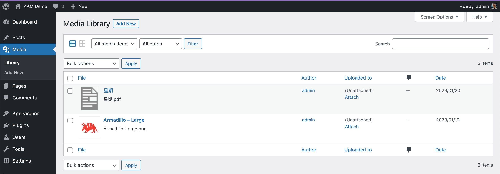
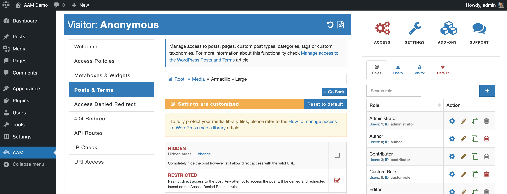
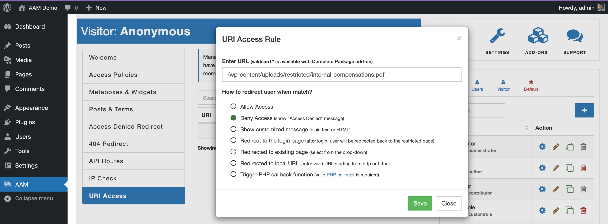

<YouTube id="akqdEgPateA" />

There are two ways to manage direct access to your WordPress files with AAM UI. Both are equally good, and you may choose either or go with a hybrid. It all depends on your website setup and access strategy requirements.

## Manage access to media items
If you added files to the website through the _Media Library_ and you see them on the list of media items, then you can choose to manage access to them with the help of [Posts & Terms](/plugin/advanced-access-manager/service/post-term) service.

In the example above, you can see that I added two files through the Media Library interface. In this case, you can manage access to each file independently. Select _Edit_ media item, and if you have [Render Access Manager Metabox](/plugin/advanced-access-manager/setting/render-access-metabox) option enabled (by default it is enabled), you should be able to the _Access Manager_ metabox where you can set proper access controls.

Another way to set access controls to any media items is to go to the AAM page and select the _Posts & Terms_ tab. Drill down to manage the "Media" post type and find your desired item. Then set your access controls accordingly.

Both ways are identical and it is just a matter of personal preference.

## Manage access to media URIs

When files are not part of the media library or live in a completely different directory (outside of the `/wp-content/uploads`), then you may consider protecting them with the [URL Access](/plugin/advanced-access-manager/service/url-access) service.

::: info FYI!
If the files that you protect live in the directory that is outside of the `/wp-content/uploads`, then make sure that your [server redirect rules](/plugin/protected-media-files/installation#setup-server-redirect-rules) are adjusted accordingly.
:::

For example, if you have a file that is located in the `/wp-content/uploads/restricted/internal-compensations.pdf`, you can create a new rule and deny access to that URI.

To do that, go to the AAM page and select the _URI Access_ tab. Create a new rule and provide either the relative path or the absolute path to the file (e. g. `/wp-content/uploads/restricted/internal-compensations.pdf` or `https://example.com/wp-content/uploads/restricted/internal-compensations.pdf`). Then select the "Deny Access" option.

## Conclusion
Managing access to the WordPress media files with [Posts & Terms](/plugin/advanced-access-manager/service/post-term) or [URL Access](/plugin/advanced-access-manager/service/url-access) service is equally good and, typically, depends on how your files are organized.

The general rule of thumb is that if your files are part of the _Media Library_, then go with the _Posts & Terms_ service. Otherwise, use the _URI Access_ service.
