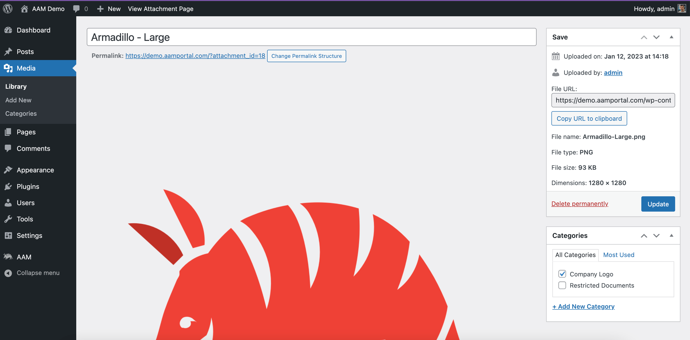
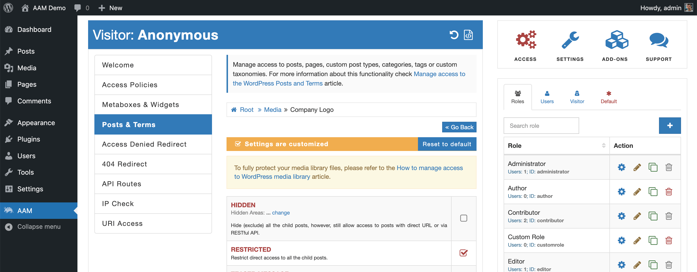
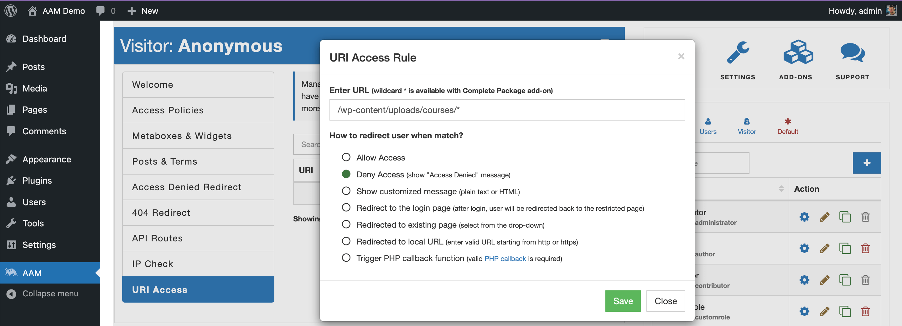

Managing access to individual files one by one may become tedious when you have many files. In this case, you may consider grouping files into a physical directory or with a custom taxonomy. Then you can define access controls to the group, and all related files will inherit those settings. In both cases, you need the premium [Complete Package](/premium) installed on your website.

::: info Note!
We have a [fair pricing program](/question/licensing/fair-price-program) if you have limited funds to buy our premium product.
:::

## Manage access by a category

The Complete Package add-on adds a new option the [Media Categories](/plugin/advanced-access-manager/setting/media-category) to the AAM Settings. If it is enabled, you should be able to see the _Categories_ metabox while editing any media item.

This way you can group your media items into categories and manage access to these categories with the [Posts & Terms](/plugin/advanced-access-manager/service/post-term) service instead of an individual item.

::: info FYI!
AAM recognizes all properly registered taxonomies. You can create your custom taxonomies and register them with the WordPress core `attachment` post type. Then you may manage access to your media items through these custom taxonomies. For more detail, refer to the [How to manage access to custom terms?](/question/content-access/access-to-custom-taxonomies) Q&A.
:::

## Manage access by a directory

When you need to manage access to all files within a directory, you can utilize the [URL Access](/plugin/advanced-access-manager/service/url-access) service instead. Here you can define a wildcard rule and all URLs that match the pattern will be restricted from direct access.

For example, let's say you need to restrict the direct access to all files that live in the `/wp-content/uploads/courses/` directory. In this case, go to the AAM page and navigate to the _URI Access_ tab. Then select the _Create New Rule_ button and enter URI `/wp-content/uploads/courses/*` as well as select _Deny Access (show "Access Denied" redirect)_ option.

## Override bulk restriction

Disregarding if you choose to manage access to your website files with _Posts & Terms_ or _URI Access_ service, in both cases, you can override restriction to any file, sub-category, or sub-directory.

