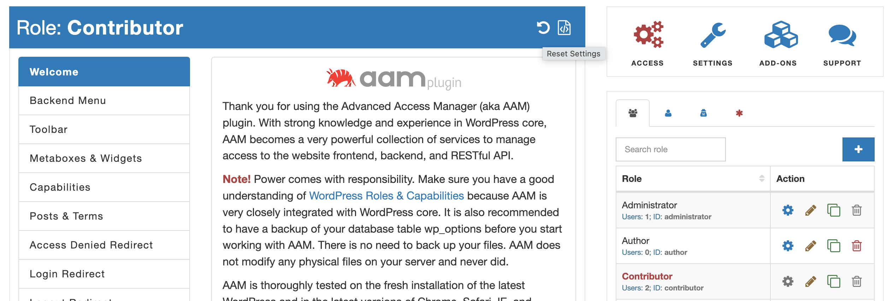

::: question Question
How can I reset AAM settings for a specific role or, when necessary,  reset all settings to default?
:::

There are three ways to reset AAM settings, depending on your particular needs. Below we'll cover them all.

::: warning Note!
AAM cannot reset changes to _roles_ and _capabilities_. If you delete any _role_ or _capability_, that is a permanent change. In this case, you need to recreate them manually or use your database backup to restore them.
:::

## Reset role or user settings

When you need to reset access control only for a role or individual user, switch to manage them and select the _Reset Settings_ button on the top status bar.

## Reset all AAM settings

Where there is a need to reset all AAM settings to default, navigate to the _Settings_ page and select the _Reset AAM Settings_ button.

## Delete AAM settings from DB

If your admin user lost access to the backend (because you made a mistake) and can't reset AAM settings with the UI, then you need to delete AAM settings from the DB.

AAM stores all the settings in the `_options` and `_usermeta` tables with the `aam_` prefix. You can connect to your MySQL database with preferred DB client and manually delete AAM records.